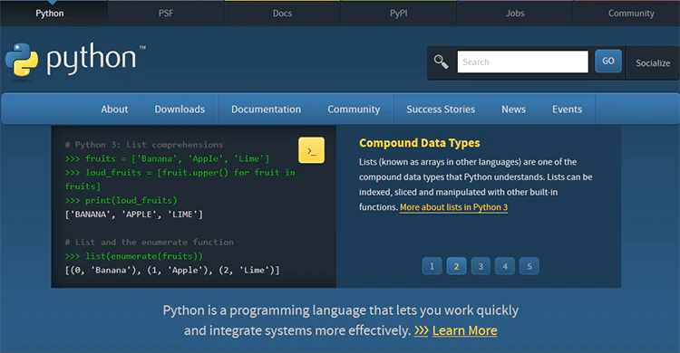

# はじめに

この資料は、以下のような方を対象として作成しています。

- 今までプログラミンに触れたことがほとんど無い。
- プログラミング言語でツールなどを作った経験がほとんど無い。
- Python でツールを作成した経験が無い。

基本的には初心者向けとして作成していますが、分かりにくい表現を見つけた場合は、
作成者に修正リクエストをお寄せ下さい。

## 資料の目的

最終的には、インターネット上の API に問い合わせを行い、そのレスポンスを処理する
Python スクリプトを作成できる程度の能力を獲得する事を目的とします。

## 資料の使い方

順番にテキストを読みつつ、ハンズオン形式でコードを作成・実行していくだけで、
必要な素養を習得する事ができるように設計されています。

ただし、テキストの内容だけでは理解が足りないと思ったり、
更に別の方向からコードの動作を検証してみたいと思った時は、
遠慮なくテキストの内容から外れて、自分の探求心を満たす為に検索したり、
試行錯誤を行ってみて下さい。

自分で手を動かせば動かすほど、知識は確固たる技術と能力に昇華されることでしょう。

## サイバーセキュリティにプログラミング能力は必要か否か

サイバーセキュリティという業務に携わっている皆さんの中には、Python に限らず、
プログラミングを学ぶ理由が、
いまいちピンと来ないという方も居られるのではないでしょうか。

確かに、普段の業務の中では Python はおろかプログラミングに触れる機会は少なく、
たまに Bash シェルを作るぐらいが関の山という方が大半かもしれません。

『別にプログラミングが出来なくても困ったことないし』

そう思うのも当然の事でしょう。

しかし、本当に困った事は無かったでしょうか？

- 大量のデータの中から、目的とする語句を含むエントリーのみを抜き出す。
- 同じような形式の文章を手動でコピペし、一部だけ編集する。
- 膨大なファイルを一つ一つ開いて中身を確認する。

これらに似たような業務を、時間をかけて行った事は無いでしょうか。おそらく、
誰もが経験した事があるのではないかと思います。

単純作業や繰り返し。これらを正確に、かつ高速で自動処理すること。これこそが、
我々がプログラミングを習得するモチベーションとなります。

もちろん、今現在の業務において、プログラミングが必須となる方は少数であることでしょう。

しかし、自動化する手段を全く知らないのと、多少なりとも知っているのでは、
そこから先で取りうる選択肢が大きく変わってくるのです。少なくとも、
『自動化できるかもしれない』という目線を持つことは、早期に獲得すればするほど、
今後の大きなアドバンテージとなってくれることは間違いありません。

## Python とは？ 又は、なぜ Python なのか？

この資料では、Python を使って作業を自動化する基礎を学んでいきます。

Python とは、プログラミング言語の一種です。その歴史は浅く、
１９９１年にオランダ人のグイド・ヴァンロッサムというプログラマーに開発されました。

現在、Python は、使用率や学びたいプログラミング言語のランキングで、
常に上位にランクインしている程の人気のプログラミング言語となっています。

なぜ、Python の人気が高いのか？ その理由には、次のような物が挙げられます。

### 1. コードの記述がシンプル

Python は、他の言語に見られるようなカッコ書きを多用せず、
インデントでコードの塊を表現します。

これにより、誰がコードを書いても、同じような部分で改行やインデントが入るため、
誰にとっても読みやすいコードが出来上がるという利点が生まれます。

また、カッコ書きや複雑なルールが少ないため、
コード作成に必要な文字数やコストが下げられ、
結果として初心者にも覚えやすいということで、初めてのプログラミングに
Python が選ばれる事も増えているそうです。

### 2. 利用できるライブラリが豊富

ライブラリとは、言語の中で利用できる、小さなプログラミングの集まりです。通常は、
目的（ウェブリクエストやデータ操作など）ごとにまとめた形で配布が行われています。

プログラマーは、ライブラリを使用することで、
本来であれば自分で書く必要のあった膨大なコードを省略し、
簡潔にすることが可能となります。

分かりやすく言えば、ライブラリは『道具箱』のような物です。
その中にはドライバーや巻き尺など、
作れなくもないけどイチから作成するには骨の折れる便利な道具類が入っています。
プログラマーは、道具箱を用意さえすれば、
すぐにでも便利な道具を使い始めることができるというわけです。

そして、このライブラリという物は、Python の人気に比例して、
多種多様な種類が様々なプログラマーによって作成され、配布されています。
そして、そのほぼ全てが、無料で使用することができるのです。
