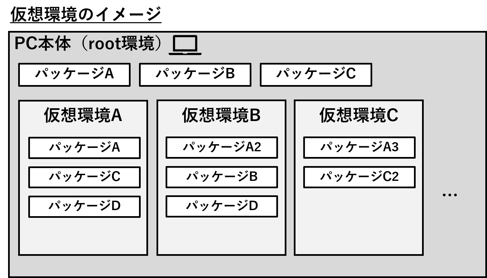
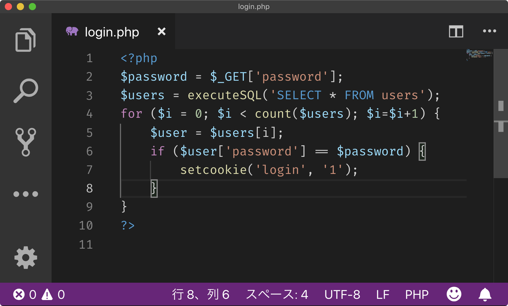
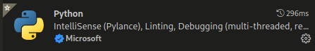

# 準備

使用する環境を準備していきましょう。

## 1. インターネットに接続できる Linux 環境の準備

インターネット上に公開されているライブラリの取得及び API
（アプリケーション・プログラミング・インターフェース）
へのアクセスが発生しますので、インターネットにアクセスできる環境を用意して下さい。

Linux のディストリビューションの種類は問いませんが、
Python 3 がデフォルトでインストールされており、かつ、
パッケージのインストールを自分で行う事が出来る程度には習熟している物を選んで下さい。

特に拘りがなければ、Ubuntu か Kali Linux が良いでしょう。

## 2. 仮想環境用パッケージのインストール

Linux 環境が準備できたならば、次のパッケージをインストールして下さい。

```bash
sudo apt install pipenv
```

`pipenv`は、Python 用の仮想環境作成ツールの一種です。

Python は様々なライブラリを導入できる反面、
ライブラリが相互に干渉してエラーを起こす等の不具合につながったり、
ライブラリが破損したりするトラブルが発生することが少なくありません。

このような事態を避けるために、Python を使ってツール等の開発を行う場合は、
あらかじめ仮想環境を作成し、
大元となる Python 環境から隔離した状態にする事がのぞましいとされています。



## 3. 仮想環境の構築

それでは、仮想環境を作成していきましょう。まず最初に、
今回使用するディレクトリを作成し、その中に移動して下さい。

```bash
mkdir ~/zip_search  # ディレクトリ名及び作成パスは自由に変更してOK
cd zip_search
```

次に、仮想環境データを格納するためのディレクトリを作成します。

```bash
mkdir .venv
```

仮想環境で使用するための Python をインストールします。

```bash
pipenv --python 3  # ３系の最新版をインストール
```

これで仮想環境の作成が完了しました。では、
仮想環境が正常に動作するかをテストするために、仮想環境の中に入ってみましょう。

```bash
pipenv shell

(zip_search)
> python --version
Python 3.9.8  # 結果はインストールされたバージョンによって変化
```

仮想環境に入ると、プロンプトの上部に仮想環境名が表示されるようになります。

仮想環境から抜けるには、`exit`コマンドを実行します。

```bash
(zip_search)
> exit
```

仮想環境が正常に動作していることを確認できれば、開発環境の準備は完了です。

## 4. おまけ：VSCode の準備

単にプログラミングコードを書くだけなら、`notepad.exe`や`vi`
でも出来ないことはありませんが、どうせなら快適な環境で行えるように、
コードエディターを導入してみましょう。

コードエディターとは、
プログラミングコードを快適に書いたり読んだりする機能が盛り込まれたソフトウェアであり、
主な機能として、シンタックスハイライト
（読みやすいようにコードをカラフルにする機能）や診断機能（記述誤りの指摘）
などを備えています。



コードエディターには様々な種類が存在しますが、その中でも特におすすめなのが、
VSCode (Visual Studio Code) です。他のエディタに比べて、動作が軽快で、
様々なプログラミング言語に対応できる拡張機能が揃っているという特徴があります。

VSCode のインストールは、下記のインターネット記事などを参考にして下さい。

- Ubuntu18にVisual Studio Codeをインストールする最も簡単な手順
  - `https://qiita.com/grgrjnjn/items/85aa7cab1475bf1aea54`

インストールが完了したならば、以下の記事を参考に、拡張機能をインストールして下さい。
基本的な Python ツールの開発であれば、困ることは無くなるはずです。

`https://docs.microsoft.com/ja-jp/learn/modules/python-install-vscode/5-exercise-install-python-extension?pivots=linux`

Python 用拡張機能



VSCode 日本語化拡張機能


また、VSCode の基本的な使用方法などは、以下を参考にすると良いでしょう。

`https://www.javadrive.jp/vscode/`
