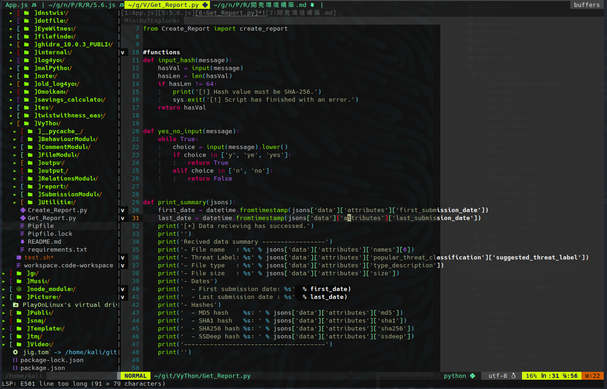

# はじめに

## Vim はリッチな開発環境になれる

Linux やサーバにログインしている時に、ファイルを編集する事になった。

使えるエディタソフトは Vim のみ。仕方がないのでコマンドを打つ。

```bash
vim configfile.conf
```

ターミナル上に現れる、無味乾燥とした、ザ・シンプルな編集画面……

コピー＆ペーストはおろか、文字入力もカーソル移動も独特すぎて理解できない。
シンタックスハイライトが有効であればいい方で、
下手をすると白黒２色しか色が無い場合も。

わかります。ぶっちゃけやる気なくしますよね。
VSCode などのリッチなエディターを普段遣いしている人は勿論、
ノートパッドなどの GUI 操作に慣れている人であれば、
Vim の操作環境は独特過ぎて、我慢できるものではないでしょう。

しかし、この画像を見て下さい。



これは、ある程度カスタマイズした Vim の画面です。

- コードが分かりやすいシンタックスハイライト
- Vim 画面からファイルを開く事ができるファイラー表示
- コード記法をチェックして誤りを指摘
- ペアになるカッコを自動で強調表示

この他にも、たくさんの便利機能が使用できるようになっています。

やった事は設定ファイルの作成・編集とプラグインの導入のみ。それだけで、
VSCode と同じぐらい、とは言えなくとも、デフォルトと比べれば、
雲泥の差で便利に使えるようになっている事は間違いありません。

少なくとも、普段のコーディングで困ることは少なくなることでしょう。

## 『でも、Vim なんて普段使わないし。覚える必要ないでしょ？』

そうですね。**正直に言って必要ありません。**

そもそも、サーバ上でしかファイルを編集できない状況というのが稀ですし、
もしそのような状況になったとしても、多少の編集ができる程度に Vim が使えれば、
問題ない場合が殆どです。

もしも大規模に編集するならローカルの IDE（統合開発環境。Visual Studio 等）
や GUI のエディタを使えばいい話ですし、そのローカル環境で Vim を使うメリットは、
エディタなどが大変進化した現在ではほぼ無いと言って良いでしょう。

しかし、この考えには重要な欠点が２つあります。

一つはスピードです。Vim 操作に慣れていなかったり、
ローカルとサーバを行き来していては、スムーズなファイル編集は困難です。
特に、サーバ上でスクリプトを実行しつつ、逐次内容を修正していくような場合、
その速度は目に見えて遅くなることでしょう。

そしてもう一つは、**かなりカッコワルイ**という事です。
ターミナル操作をしているのに、ファイルの編集一つ満足にできない。
Vim の操作に習熟せず、操作の簡単な GUI に逃げているヌーブ（Noob / 初心者）。
そう思われても仕方がないでしょう。ターミナルから逃げていいのは小学生までです。

冗談はさておき。

ギーク（Geek / 上級者）になれとは言いませんが、
ある程度以上に Linux に接する立場にあるのであれば、
誤編集によるミスの発生を防いだり、素早いエラー対応をするためにも、
やはり Vim の操作には、ある程度習熟している方が望ましいでしょう。

加えて、Vim のカスタマイズ方法を知っていれば、
より確実なファイル編集や開発の高速化を図ることも可能となります。

全ての操作を Vim でやることは不可能ですし、非効率です。しかし、だからこそ、
Vim で操作をした方が効率的な場合にはストレス無く Vim を選択できるように、
Vim についてあらかじめ学んでおく事は、大きな意味を持っているのです。
