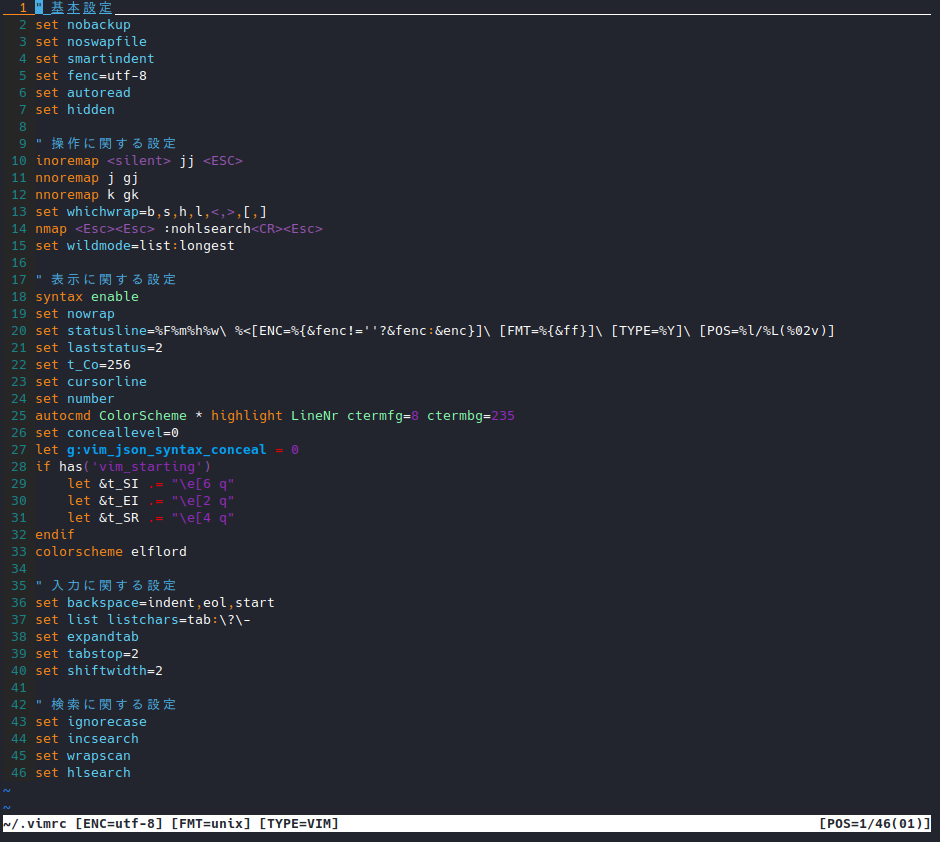

# 設定ファイル（.vimrc）の編集

それでは早速、設定ファイルの編集から始めましょう。

Vim は独特の見た目と挙動を持つエディタソフトですが、
その原因のある程度は、設定ファイルで低減する事が出来ます。

ストレスの多い環境で操作を学ぶよりも、
ある程度快適に設定された環境で学ぶほうが効率的であろうとの考えから、
本資料の中では、最初に設定ファイルの編集を取り上げます。

## 1. Vim のインストール確認

最初に、Vim がインストールされているかを確認します。

現在、殆どの Linux 環境では、Vim が最初からインストールされており、
`vi`又は`vim`コマンドで実行する事ができますが、一部の環境では例外的に
インストールされていない場合もあります。

```bash
sudo apt list vim
```

コマンドの結果、インストール済みとなっていれば OK です。

## 2. 設定ファイルの作成

それでは、設定ファイルを編集していきましょう。

とはいっても、Vim の設定ファイルは、
実はデフォルトの状態では存在すらしていません。

従って、まずは以下のコマンドで、空の設定ファイルを作成しましょう。

```bash
touch ~/.vimrc
```

これで、現在のユーザーのホームディレクトリに、`.vimrc`ファイルが作成されました。

この`.vimrc`は、ユーザーのホームディレクトリに配置する事で、
Vim 起動時に自動的に読み込まれ、設定が反映されるようになります。

従って、複数のユーザーで設定を共有したい場合は、
基本的に`.vimrc`の内容を共有すれば、同じ環境を使う事が可能となります。

## 3. 設定ファイルの編集

`.vimrc`は Vim 専用の言語でルールを記述する事により、
様々な設定を施すことができます。

設定言語の仕様を理解すれば、自由自在にルールを追記する事も可能となりますが、
Vim を普通に使うだけであれば、そこまで習熟する必要もありませんし、
代表的な設定はネット上にいくらでも共有されていますので、
今回はコピー＆ペーストで設定ファイルを作成していきます。

なお、設定を書き込む際に Vim を使用する事となりますので、
次の基本操作だけは覚えておいて下さい。

```text
Vim でファイル編集を開始
  ターミナル上で vim ファイル名

カーソル移動
  左：h (又は左矢印キー)
  下：j (又は下矢印キー)
  上：k (又は上矢印キー)
  右：l (又は右矢印キー)

入力モード・非入力モードの切り替え
  入力モードのオン：i
  入力モードのオフ：ESC

ファイルの保存・終了
  保存：入力モードのオフ時に :w を入力してエンター
  終了：入力モードのオフ時に :q を入力してエンター
  保存と終了を同時に：入力モードのオフ時に :wq を入力してエンター
  保存せずに終了：入力モードのオフ時に :q! を入力してエンター

クリップボードからペースト
  1. 入力モードオフ時に :set paste を入力してエンター
  2. 入力したい箇所にカーソルを移動
  3. 入力モードをオン
  4. Ctrl + Shift + V を押す、又はマウスの右クリックメニューから貼り付けを選択
```

もしも設定ファイルの編集に失敗しても、慌てる必要はありません。
最悪の場合でも、ファイルを再作成さえすれば良いのです。

では、`.vimrc`に入力する設定を、説明を交えて記載します。
最後にコピー＆ペースト用の全設定も併記しますので、そちらも利用して下さい。

### 3.1. 基本的な挙動に関する設定

```bash
set nobackup   
set noswapfile 
set smartindent
set fenc=utf-8
set autoread
set hidden
```

この部分では、主にファイルオープンやファイル作成に関わる設定を記述しています。
通常のテキストエディタ等の挙動に近づけるように設定されています。

- `nobackup`, `noswapfile`
  - バックアップファイル及びスワップファイルを作成するかどうか。
  - 不要なファイルの残留を無くすために、作成しないよう設定
- `smartindent`
  - 改行時、自動で最適なインデントが挿入される。
- `fenc=utf-8`
  - 使用する文字コードに`UTF-8`を指定
- `autoread`
  - 現在開いている未編集ファイルが外部で編集された場合に再読込を行う。
  - ログファイルなどを Vim で見る際、追記・編集が自動で反映されるようになる。
- `hidden`
  - 編集したファイルが未保存であっても、別のファルを開けるようにする。

### 3.2. 操作に関する設定

```bash
inoremap <silent> jj <ESC>
nnoremap j gj
nnoremap k gk
set whichwrap=b,s,h,l,<,>,[,]
nmap <Esc><Esc> :nohlsearch<CR><Esc>
set wildmode=list:longest
```

操作の簡略化や、違和感を低減するための設定です。

- `inoremap <silent> jj <ESC>`
  - 入力モードのオフを、ESC の他に`jj`でも出来るようにする。
  - 入力を高速にするための設定。自分に合わないようであれば削除も可
- `nnoremap j gj`, `nnoremap k gk`
  - 行が折り返した場合、表示行の単位でのカーソル移動を可能にする。
- `set whichwrap=b,s,h,l,<,>,[,]`
  - 行末から行頭、行頭から行末へのカーソル移動を可能にする。
- `nmap <Esc><Esc> :nohlsearch<CR><Esc>`
  - 検索結果のハイライトを、ESC キー連打で解除する。
- `set wildmode=list:longest`
  - コマンドに入力するファイル名のタブ補完をイイ感じにする。

### 3.3. 表示に関する設定

```bash
syntax enable
set nowrap
set statusline=%F%m%h%w\ %<[ENC=%{&fenc!=''?&fenc:&enc}]\ [FMT=%{&ff}]\ [TYPE=%Y]\ [POS=%l/%L(%02v)]            
set laststatus=2
set t_Co=256
set cursorline
set number
autocmd ColorScheme * highlight LineNr ctermfg=8 ctermbg=235
set conceallevel=0
let g:vim_json_syntax_conceal = 0
if has('vim_starting')
    let &t_SI .= "\e[6 q"
    let &t_EI .= "\e[2 q"
    let &t_SR .= "\e[4 q"
endif
colorscheme elflord
```

見た目がショボイのを何とかする設定です。
一部、表示に関わる問題を解決するための設定も含みます。

- `syntax enable`
  - シンタックスハイライトを有効にする。
- `set nowrap`
  - 長い業の折返しを無効化する。
  - 業の長いログファイルや複雑なコードを見る際に役立つが、編集時には不便な場合もある。
  - 好みに応じて削除してもよい。
- `set statusline=~`, `set laststatus=2`
  - 画面下部にステータスラインを常に表示させる。
  - 表示する情報は、ファイルフォーマット、文字エンコード、ファイルタイプ及びカーソル位置
- `set t_Co=256`
  - 256 色カラーを使用する。
- `set cursorline`
  - 現在のカーソル行をハイライトする。
- `set number`, `autocmd ColorScheme * highlight LineNr ctermfg=8 ctermbg=235`
  - 行番号を表示する。また、行番号のみ表示色を変更する。
- `set conceallevel=0`, `let g:vim_json_syntax_conceal = 0`
  - JSON のダブルクォーテーションが一部のプラグインで消える問題を解決する。
- `if has ~ endif`
  - カーソルの形状を、入力モード時はライン、非入力モード時はブロックにする。
- `colorscheme elflord`
  - カラーテーマを`elflord`に設定する。
  - デフォルトで使用できるテーマ一覧：`https://nanasi.jp/colorscheme/default_install.html`

### 3.4. 入力に関する設定

```bash
set backspace=indent,eol,start
set list listchars=tab:\?\-
set expandtab
set tabstop=2
set shiftwidth=2
nnoremap ( 0
nnoremap ) $
nnoremap <S-w> b
nnoremap <S-e> ge
```

入力モード時の挙動に関わる部分です。

- `set backspace=indent,eol,start`
  - 入力モード中、Backspace キーで文字を消せるようにする。
- `set list listchars=tab:\?\-`
  - タブが入力されている場合、`\?\-`で視覚化する。
- `set expandtab`
  - タブ入力をスペースにする。
- `set tabstop=2`, `set shiftwidth=2`
  - タブキーを入力した場合のスペースの数を２に設定する。
- `nnoremap ( 0`, `nnoremap ) $`
  - 行頭・行末への移動キーを変更する。
- `nnoremap <S-w> b`, `nnoremap <S-e> ge`
  - 単語単位の移動キーを変更する。

### 3.5. 検索に関する設定

```bash
set ignorecase
set incsearch
set wrapscan
set hlsearch
```

検索を使いやすくするための設定です。

- `set ignorecase`
  - 検索時、入力が全て小文字の場合は、大文字小文字の区別を無視する。
- `set incsearch`
  - インクリメンタルサーチ（入力文字の逐次検索）を有効化
- `set wrapscan`
  - ファイル末尾まで検索した後、ファイル先頭に循環する。
- `set hlsearch`
  - 検索にヒットした部分をハイライトする。

## 4. 設定の全体（コピー＆ペースト用）

設定をファイルに書き込む場合は、以下のようにコメント（"）を付けておくと、
後々編集する際のヒントになるでしょう。

但し、Vim を多用することになる Linux サーバには、
２バイト文字（日本語）がインストールされていない場合も多々存在します。

そのような場合、日本語のコメントは文字化けして読めなくなってしまうので、
英語を使用したり、半角英数字のローマ字表記を使用したりする必要があります。

```text
" 基本設定
set nobackup
set noswapfile
set smartindent
set fenc=utf-8
set autoread
set hidden

" 操作に関する設定
inoremap <silent> jj <ESC>
nnoremap j gj
nnoremap k gk
set whichwrap=b,s,h,l,<,>,[,]
nmap <Esc><Esc> :nohlsearch<CR><Esc>
set wildmode=list:longest

" 表示に関する設定
syntax enable
set nowrap
set t_Co=256
set cursorline
set number
set conceallevel=0
let g:vim_json_syntax_conceal = 0
if has('vim_starting')
    let &t_SI .= "\e[6 q"
    let &t_EI .= "\e[2 q"
    let &t_SR .= "\e[4 q"
endif
colorscheme elflord

" 入力に関する設定
set backspace=indent,eol,start
set list listchars=tab:\?\-
set expandtab
set tabstop=2
set shiftwidth=2
nnoremap ( 0
nnoremap ) $

" 検索に関する設定
set ignorecase
set incsearch
set wrapscan
set hlsearch
```

ここまでの設定を`.vimrc`に反映させると、表示画面は以下のようになる筈です。

特別な機能を使用せず、普通のテキストエディタとして使用するだけであれば、
現在の状態でも使用に耐える事が出来る程度には整っているはずです。

また、Vim 特有の操作を除いて、カーソル移動時などの独特の挙動も抑えられ、
普通のテキストエディタ寄りに設定されています。


