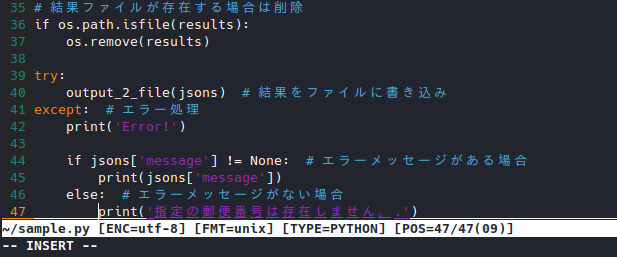
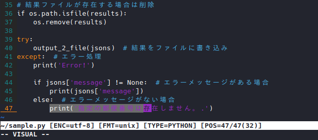
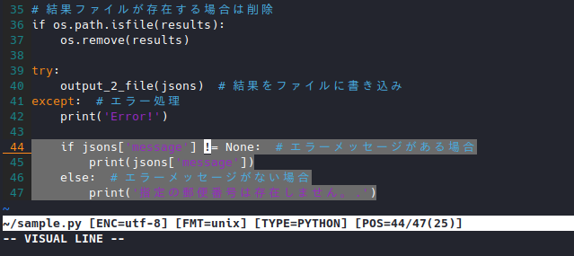
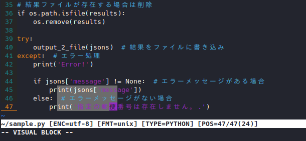

# Vim の基本的な操作：Vim が有するモードについての説明

## 1. ノーマルモード、インサートモード、ビジュアルモード

さて、Vim による文字入力に移る前に、Vim 特有の概念である
『モード』について覚えましょう。

Vim には、大きく分けて次のモードが存在します。

```text
ノーマルモード  ：カーソル移動、コピー＆ペースト、コマンド入力を行う。
インサートモード：文字入力を行う。
ビジュアルモード：文章の選択と選択範囲のコピーを行う。
```

インサートモードからビジュアルモードに移行したり、

これら３つのモードを行き来しながら、Vim は文章編集を行います。

では、実際に、それぞれのモードを体験してみましょう。

### 1.1. ノーマルモード

```text
ノーマルモードへ移行：（インサートモード又はビジュアルモード中に）ESC、又はjj
```

ノーマルモードは、カーソル移動の説明において、非入力モードと読んでいたモードです。

基本となるモードであり、Vim を起動した際のデフォルトでもあります。

このモードでは、主にカーソル移動やカーソルジャンプ、コピー＆ペースト、

コマンド入力を行います。

カーソル移動の説明で触れているので、ここではハンズオンを省略します。

### 1.2. インサートモード

```text
インサートモードへ移行：ノーマルモード中に以下を入力
                        - i: カーソル位置の前から編集を開始
                        - a: カーソル位置の後から編集を開始
                        - I: 行頭から編集を開始
                        - A: 行末から編集を開始
                        - s: カーソルを削除して編集開始
                      ：ビジュアルモード中に以下を入力
                        - I: 選択範囲の先頭から編集開始
                        - A: 選択範囲の最後から編集開始
                        - s: 選択範囲を削除して編集開始
```

インサートモードは、文字入力を行うモードです。

一応、矢印キーでのカーソル移動も可能ですが、
Vim 特有のカーソル移動用キーバインドは使用できなくなるため、
こまめにノーマルモードと切り替えて使うのが良いでしょう。

では、実際にインサートモードを体験してみます。
詳しいインサートモードへの入り方は文字入力の項目で説明するので、
まずは Vim を起動し、ノーマルモードである事を確認してから、`i`を押して下さい。



カーソルがブロックからライン形状に変化するとともに、
左下に`-- INSERT --`とモードが表示されたかと思います。

この状態で、つづけて文字入力を行うと、
押したキーの文字がそのまま入力されるようになります。

次に、インサートモードを抜けて、ノーマルモードに戻ってみましょう。
`ESC`キーを押すと、左下の`-- INSERT --`表示が消えて、
ノーマルモードに戻った事がわかります。

なお、インサートモードからノーマルモードに戻る際、
キーボードの片隅にある`ESC`を押すのが面倒に感じる場合は、
`.vimrc`で追加したキーバインドである、`jj`を試してみましょう。

インサートモードで`jj`と入力することで、ホームポジションを崩すこと無く、
素早くモードを切り替えることが可能となります。

※注：モード表示が`--INSERT (paste) --`となっている場合、
`jj`のキーバインドは実行できません。
ノーマルモードで`:set nopaste`と入力して、ペースト状態を解除してから試して下さい。

### 1.3. ビジュアルモード

```text
ビジュアルモードへ移行：ノーマルモードで以下を入力
                        - v: カーソルの位置から範囲選択を開始
                        - Shift + v: カーソルの行から行単位選択を開始
                        - Ctrl + v: カーソルの位置から矩形選択を開始
```

ビジュアルモードは、文字の範囲選択を行うモードです。

通常のテキストエディターで言えば、
特定範囲の文字をコピーしたり切り取ったり削除したりする為に`Shift`キーを使用しますが、
Vim ではビジュアルモードが`Shift`キーを押している状態に相当します。

なお、Vim のビジュアルモードは、上記の通り３つに分かれています。
それぞれに使い勝手が異なりますので、一通り体験してみましょう。

#### 1.3.1. 通常の範囲選択

まず、通常の範囲選択を使用してみましょう。
Vim がノーマルモードであることを確認してから`v`を押して下さい。



ビジュアルモードに入ると、画面左下に`-- VISUAL --`と表示されると同時に、
カーソルを移動（`hjkl OR 矢印キー`）させると文字が選択されるようになりました。

ビジュアルモードでは、こうして選択状態になった範囲に対して、
様々な処理を行うことができます。

簡単な所では、選択範囲のコピー、切り取り及び削除、複雑なものになると、
選択範囲の検索や置換などが実行可能です。

ビジュアルモードを抜けるには、インサートモードと同じく、`ESC`キーを使用します。

#### 1.3.2. 行単位の範囲選択

次に、行単位での範囲選択を使用してみましょう。

Vim がノーマルモードであることを確認してから`Shift + v`を押して下さい。



左下に`-- VISUAL LINE --`と表示されると同時に、カーソルを上下に動かすと、
カーソルの位置に関わらず行全体が選択されるようになりました。

行単位選択は、複数行のコピーや削除、検索・置換範囲の指定など、
複数の目的に多用しますので、必ず覚えておきましょう。

#### 1.3.3. 矩形での範囲選択

最後に、矩形（ブロック形状）の範囲選択を使用します。

Vim がノーマルモードであることを確認してから`Ctrl + v`を押して下さい。



左下に`-- VISUAL BLOCK --`と表示され、カーソル位置から改行や折返しを無視して、
ブロック型の範囲で選択されるようになりました。

矩形範囲選択は、例えば以下のように、縦によく似た文字列が並んでいる場合などに、
複数行に対して処理（先頭数文字を一斉に削除・置換したり等）する場合に有効です。

```python
# 矩形選択を使用すると、先頭の var のみを削除したり置換したりが簡単にできる。

varDate = datetime.date.today()
varStr  = "Today's Date."
varNum  = 365
```
