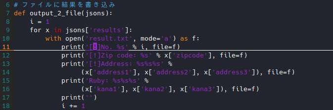

# Vim の基本的な操作：文字入力とアンドゥ・リドゥ

Vim 習得における最大の難所にして、Vim が高速なテキストエディタである所以の、
文字入力及びコピー＆ペーストについて学んでいきましょう。

最初に断言しますが、**Vim 操作は高速なテキストエディットを可能とします。**
これは疑いようのない事実です。

自身の文字入力を考えてみて下さい。キーボードから手を離さず入力している時間が、
一体どれだけ持続できているでしょうか。

マウスを操作したり、矢印キーでカーソルを移動させたり、
コピー＆ペーストのためにキーボードを確認したりする瞬間は、
自分が思っているよりも多く、文字入力を阻害する原因となっているはずです。

加えて、文章やコードの推敲のために、文字列を切り貼りしたり、
先頭行のインデントを揃えるために、カーソルキーとスペースキーを何度も叩くなど、
時間のかかる処理をしている事が、きっとあるはずです。

『それ、Vim なら一瞬で出来ますよ？』

Vim の文字入力操作を習得して、高速インプットを実現しましょう。

まずは、基本的な文字入力からです。

## 1. 基本的な文字入力の開始：ノーマルモード

文字入力を開始するには、インサートモードに入る必要がありますが、
Vim にはインサートモードに入るためのキーバインドが複数あるため、
少しややこしいことになっています。

```text
インサートモードへ移行：ノーマルモード中に以下を入力
                        - i: カーソル位置の前から編集を開始
                        - a: カーソル位置の後から編集を開始
                        - I: 行頭から編集を開始
                        - A: 行末から編集を開始
                        - s: カーソルを削除して編集開始
                      ：ビジュアルモード中に以下を入力
                        - I: 選択範囲の先頭から編集開始
                        - A: 選択範囲の最後から編集開始
                        - s: 選択範囲を削除して編集開始
```

上記を参考に、まずはノーマルモードからの移行を試してみましょう。

### 1.1. カーソル位置からの編集開始

カーソル位置からインサートモードに入り編集を開始するには、
次のいずれかを使用します。

```text
i: カーソル位置の前から編集を開始
a: カーソル位置の後から編集を開始
s: カーソルを削除して編集開始
```

これらの内、`i`, `a`, `s`は、違いが少しわかりにくいので、少し詳しく説明しましょう。

以下のイメージを見て下さい。

```text
カーソル位置
↓
あいうえお

# i を押すと
カーソル位置
↓
｜あいうえお

# a を押すと
  カーソル位置
  ↓
あ｜いうえお

# s を押すと
カーソル位置
↓
｜いうえお
```

このように、Vim はインサートモードの入り方によって、
押す必要のあるキーが変化する特徴があります。

最初はわかりにくいかもしれませんが、何度か練習してイメージを掴んでいきましょう。

### 1.2. 行頭・行末からの編集開始

行頭・行末からインサートモードに入り編集を開始するには、
次のいずれかを使用します。

```text
I: 行頭から編集を開始
A: 行末から編集を開始
```

これらのキーバインドは、カーソルを移動させる手間を大きく減らす事ができるので、
必ず覚えておくことをおすすめします。

また、カーソル移動の項で説明した『行頭・行末への移動』についても、
移動後に編集が発生する場合は、こちらを使用することが可能となります。

ただ単に移動するだけの状況は発生しにくいことから、こちらの`I`, `A`
だけを覚えておいても、大きな問題は無いでしょう。

### 1.3. 行を追加・削除してからの編集開始

カーソルの位置する行の前または後に空白行を挿入し、
その行からインサートモードで編集を開始する操作です。

主に既存の行に文章を挿入したり、最終行に追記する場合に使用することができます。

```text
o: 現在の行の次に空白行を挿入して編集を開始
O: 現在の行の前に空白行を挿入して編集を開始
```

## 2. ビジュアルモードからの編集開始

ビジュアルモードから編集を開始する方法をおぼえておく事で、
複数行の同時編集ができるようになります。

同時編集を利用するイメージは、体験したことがないと想像しづらいと思いますので、
まずは以下の操作を試してみましょう。

### 2.1. 選択範囲の先頭を同時編集

1. サンプルファイルの以下の部分（３行分の`import`）を、`Ctrl + v`で矩形選択


2. `I`を入力
3. 適当な文字（例：`#`）を入力
4. `ESC`又は`jj`でノーマルモードに戻る。
5. 以下の通り複数行に文字が入力される。


選択範囲の先頭行の同時編集は、このように複数行をコメントアウトしたり、
複数行にインデントを入力したりする場合に有効です。

### 2.2. 選択範囲の最後を同時編集

1. サンプルファイルの以下の部分（３行分の`'`）を、`Ctrl + v`で矩形選択


2. `A`を入力
3. 適当な文字（例：`[?]`）を入力
4. `ESC`又は`jj`でノーマルモードに戻る。
5. 以下の通り複数行に文字が入力される。


選択範囲の最後を同時編集する機会は多くありませんが、
複数行の先頭の編集とあわせて、ついでに覚えておいてもいいでしょう。

### 2.3. 選択範囲を削除して同時編集

1. サンプルファイルの以下の部分（３行分の`'`）を、`Ctrl + v`で矩形選択


2. `s`を入力
3. 適当な文字（例：`!`）を入力
4. `ESC`又は`jj`でノーマルモードに戻る。
5. 以下の通り複数行の`?`が`!`に変更される。



選択範囲の削除・編集は、かなり多用する操作です。

今回は矩形選択で行いましたが、`v`の範囲選択や
`Shift + v`の行選択でも同様操作ができますので、同じく練習してみて下さい。

## 3. アンドゥ・リドゥ

他のテキストエディタ同様、Vim にも、操作を取り消したり、
逆にやり直したりする操作として、アンドゥ・リドゥ機能が備わっています。

```text
アンドゥ：u
リドゥ  ：Ctrl + r
```

これらの操作感は、
キーボードの`Ctrl + z`又は`Ctrl + y`で行うアンドゥ・リドゥと概ね同じですが、
インサートモードで行った文字入力だけは、以下の通り特殊な挙動を示すため、
この点にだけは注意が必要です。

```text
1. ノーマルモード => インサートモード
2. 文字入力（abcdef）、改行して文字入力（ghijk）
3. インサートモード => ノーマルモード
4. アンドゥ（u）すると、『2. で行った全ての入力』が一度に消える。
```
