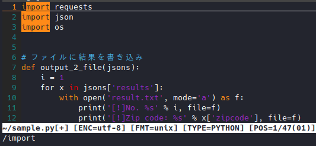

# Vim の基本的な操作：検索、置換

Vim は強力な検索・置換機能を持っていますが、
操作が少し独特であるため、最初は簡単な検索だけを使用して、
特殊な挙動に慣れていくようにしましょう。

## 1. 検索

### 1.1. 基本的な検索

Vim で文字列を検索をするには、ノーマルモードで`/`キーを入力し、
検索文字列を入力してからエンターキーを押します。

試しに、サンプルファイルを開いた状態で、`/set`と入力してエンターキーを押して下さい。



検索文字列にヒットした部分が、文字入力ごとにハイライトされました。

次に、`n`キーを複数回押してみて下さい。
キーを押すごとにカーソルが検索ヒット部分にジャンプし、
最後のヒット部分から先頭のヒット部分に循環する様子が確認できたと思います。

また、`Shift + n`を押すことで、上方向にジャンプすることも可能です。

このように、検索をすることでファイルのどこに文字列があるのかを調べられるだけでなく、
たとえば、プログラミングコードの変数名や関数名に誤りが無いか
（誤っていた場合は、検索してもヒットしない）をチェックしたり、
変数が事前に定義されているかどうかをチェックすることも可能となります。

### 1.2. 特殊な検索（パターン検索）

Vim は、検索において、パターン検索と呼ばれる特殊な検索を行うことができます。

パターン検索を正確に行うには、正規表現を理解している必要があるため、
初心者には理解が難しく、使いこなすのは困難といえるでしょう。

また、パターン検索が必要になる状況は、大きなサイズのログファイルを検索したり、
何らかのレスポンスデータを整形するために使用する場合がほとんどであり、
個人が作成・利用するファイルで必要になる場面は、ほぼありません。

なので、本資料では、『例えばこういった検索ができる』という紹介に留めることにします。

詳しく正規表現や Vim のパターン検索を知りたい方は、
以下のサイトを参考にしてみて下さい。

- Vim でパターン検索するなら知っておいた方がいいこと
  - <https://deris.hatenablog.jp/entry/2013/05/15/024932>

#### 1.2.1. パターン検索例１：曖昧な検索

例えば、`http`と`https`の２通りの文字列があり、どちらも検索でヒットさせたい場合、
以下のようにパターン検索を入力します。

```text
/http.*
```

ここで使用されているのは、正規表現と呼ばれる特殊なパターン記法です。
上記に使用されている`.*`は、『なんらかの文字が０回以上続く』を表します。

従って、`http`の後に何も続かない（０回）場合も、`s`が１回続く場合も、
どちらの場合も検索がヒットします。

他にも、例えば`/p.*t`と入力すると、`print`と`put`の両方がヒットするなど、
かなり曖昧な検索が可能となります。

#### 1.2.2. パターン検索例２：２つのパターンでの検索

先述した曖昧な検索は、文字列の一部分が合致する場合の検索ができましたが、
全くことなる文字列を指定して、どちらかがヒットした場合を検索することもできます。

```text
/\(while\|for\)
```

これは、`while`又は`for`を検索対象として指定する場合のパターンとなります。

やたらと`\（バックスラッシュ）`が入力されているのが目につくかと思いますが、
これは『メタ文字』と呼ばれる一部の文字を、検索文字列ではなく、
特殊な機能を持つ文字として認識させるために、バックスラッシュを付加しているのです。

今回の場合であれば、`(`, `|`, `)`の三文字がメタ文字に当たります。

このような処理は、一般的に『エスケープ処理』と呼ばれます。

従って、エスケープ処理のためのバックスラッシュを取り除いて見やすくすると、
本来のパターン検索文字列は、次の通りになっている事がわかります。

```text
/(while|for)
```

## 2. 置換

Vim の置換には、通常のテキストエディタとは異なり、
置換するにあたり多数のオプションが存在します。

しかし、その全てを覚えるのは困難ですし、利用頻度が低いものもありますので、
以下に示す、利用頻度の高いものだけ見ていくことにしましょう。

1. 全体又は選択範囲のみの置換
2. 置換するかどうか、確認しつつ置換

それぞれの操作について確認していきましょう。

### 2.1. 全体の置換

ファイル全体を対象に置換する場合は、ノーマルモードで次のコマンドを入力します。

```text
:%s/置換対象文字列/置換後の文字列/g
```

入力後にエンターキーを押すことで、ファイルに存在する全ての置換対象文字列が、
置換後の文字列に一瞬で置き換わります。

ちなみに、コマンドの中に含まれている`%s`は『現在開いているファイル全体を対象』
とする意味があり、`g`には『検索にヒットした全てを置換』と、
それぞれに重要な意味を持っています。

### 2.2. 選択範囲の置換

選択した範囲でのみ置換をする場合は、ビジュアルモードで範囲を選択してから、
次のコマンドを入力します。

```text
:s/置換対象文字列/置換後の文字列/g
```

`%`が無くなっただけで、全体の置換をする時と同じなので、
混乱することは少ないのではないでしょうか。

なお、範囲選択をしてから`:`を入力すると、
コマンド領域に次のような文字列が表示されていると思います。

```text
:'<,'>
```

これは、Vim が自動で挿入した、現在の選択範囲を示す文字列なので、
削除したりすることなく、以降の`s/置換対象文字列/置換後の文字列/g`
を入力して下さい。

### 2.3. 置換するかどうか、確認しつつ置換

確認しつつの置換を使うことで、
誤って必要のない部分まで置換してしまうことを防ぐことができます。

とはいえ、大きなサイズの置換をチマチマとチェックしつつ行っていては時間がかかりますので、
置換対象文字列の指定に自信が無い場合に、保険として行う程度に留めるのがいいでしょう。

置換する際に確認をいれるには、次のコマンドを入力します。

```text
全体置換：%s/置換対象文字列/置換後の文字列/gc
範囲置換： s/置換対象文字列/置換後の文字列/gc
```

末尾にチェックを表す`c`を付けることで、置換時に確認が行われるようになります。

```text
xxxx に置換しますか？ (y/n/a/q/l/^E/^Y)

y:  はい
n:  いいえ
a:  すべてはい
q:  中止
l:  現在の行にだけ適用する
^E: Ctrl + e で上にスクロール
^Y: Ctrl + y で下にスクロール
```
