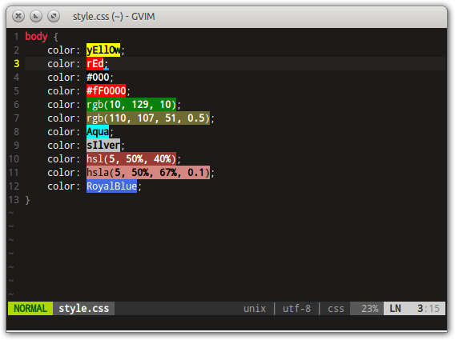

# プラグインの導入

前回までの資料で、Vim をカスタマイズして基本的な操作を行う準備は整いました。
例えば、サーバ上のターミナルに SSH ログインした際の操作を改善するだけなら、
前述した`.vimrc`の内容をコピー＆ペーストすれば実現できる事になります。

しかし、Vim は外部からプラグインを導入することで、
更に強力な機能を発揮することができます。

ここからはオマケとして、『Vim でコード開発をバリバリやりたい』とか、
『ローカルの Vim を調教しまくって俺好みにしたい』
という~~変態~~マイナーな方向けに、プラグインの導入方法と便利なプラグインを紹介します。

なお、各プラグインで説明している操作や効果はプラグインの一部のみですので、
詳しくは各プラグインのページやブログ記事などを参考にして下さい。

## 1. プラグインの導入方法

次の手順を踏むことで、プラグインを導入するための環境を整えて、
簡単にプラグインをインストールできるようになります。

1. プラグインマネージャーの導入
2. プラグインのリポジトリ確認
3. プラグインのインストールと細部設定

### 1.1. プラグインマネージャーの導入

プラグインマネージャーとは、Vim のプラグインを自動で導入し、
有効化・無効化を管理するソフトウェアです。

Vim のプラグインマネージャーにもいくつかあるのですが、
ここでは使い勝手がシンプルで理解しやすい`vim-plug`を使用します。

#### 1.1.1. plug.vim のダウンロード、指定ディレクトリへの配置

この操作を一括で行ってくれるコマンドが以下になります。
インターネットに接続できる環境であることを確認してから実行して下さい。

```bash
curl -fLo ~/.vim/autoload/plug.vim --create-dirs \
    https://raw.githubusercontent.com/junegunn/vim-plug/master/plug.vim
```

#### 1.1.2. .vimrc の編集

`.vimrc`の最後に、以下の３行を追加して下さい。

```bash
call plug#begin()
Plug 'scrooloose/nerdtree'
call plug#end()
```

`vim-plug`でプラグインを有効化するためには、上記の通り、
`call plug#begin()`と`call plug#end()`の間に、有効化したいプラグインを
`Plug 'プラグイン名'`で記述していきます。

ここで記述されたプラグインは、後述するインストールの対象となるだけでなく、
Vim 起動時には自動的に有効となります。

なお、プラグインを無効にしたい場合は、
該当のプラグインの行をコメントアウトすれば OK です。

### 1.2. プラグインのリポジトリ確認

Vim のリポジトリは GitHub で管理されています。

気になるプラグインをみつけた場合は、GitHub の該当ページを確認して、
URL の以下の部分をプラグイン名として使用して下さい。

```text
https://github.com/preservim/nerdtree
             Plug 'preservim/nerdtree'
```

プラグイン名を確認できたならば、`.vimrc`を編集しておきましょう。

### 1.3. プラグインのインストール

`.vimrc`を編集・保存した後、以下のどちらかを行って下さい。

1. ノーマルモードで`:so ~/.vimrc`を実行し、`.vimrc`を再読み込み。
2. Vim を再起動して`.vimrc`を再読み込み。

その後、`:PlugInstall`コマンドを実行すると、
有効化されたプラグインが自動的にダウンロードされ、インストールされます。

その後、Vim を再起動すればプラグインの機能が使用できるようになります。

## 2. おすすめのプラグイン１：操作の改善

ここからは、Vim でコーディングをする上で便利なプラグインを紹介していきます。

まずは、あると絶対に便利な、操作を改善してくれるプラグイン群を紹介します。

### 2.1. preservim/nerdtree


```bash
Plug 'preservim/nerdtree'
```

Vim 画面の左側にファイラ画面を表示。
複数のファイルを Vim から離れることなく続けて編集・比較しやすくなります。

ファイラ画面のオン・オフは`:NERDTreeToggle`コマンドで行いますが、
`Ctrl + o`でオン・オフすることができるよう、
下記の設定を`.vimrc`に加えることを推奨します。

```bash
nnoremap <C-o>   :NERDTreeToggle<CR>
```

### 2.2. fholgado/minibufexpl.vim


```bash
Plug 'fholgado/minibufexpl.vim'
```

Vim では開いた複数の切り替える事ができますが、今現在、
何のファイルを開いているかはどこにも表示されません。

このプラグインは、今現在開かれているファイルの一覧を表示してくれます。

なお、開いているファイルの切り替えは`:bnext`, `:bprevious`、ファイルを閉じるには
`:bdelete`コマンドを使用しますが、切り替えが面倒になるので、
`Ctrl + h（前のファイルを開く）`, `Ctrl + l（次のファイルを開く`
, `Ctrl + w（現在表示しているファイルを閉じる）`で切り替え・削除ができるように、
下記の設定を`.vimrc`に加えることを推奨します。

```bash
nnoremap <C-h> :bprevious<CR>
nnoremap <C-l> :bnext<CR>
nnoremap <C-w> :bdelete<CR>
```

### 2.3. tpope/vim-commentary

```bash
Plug 'tpope/vim-commentary'
```

コマンド一発で行単位のコメントアウト・解除ができるプラグイン。

Vim の矩形選択 => 挿入の操作よりも高速でコメントアウトすることができます。

```text
操作：
  カーソル行をコメントアウト・解除  ：gcc
  選択範囲の行をコメントアウト・解除：ビジュアルモード選択後、gc
```

### 2.4. ConradIrwin/vim-bracketed-paste

```bash
Plug 'ConradIrwin/vim-bracketed-paste'
```

クリップボードから Vim にペーストする場合は`:set paste`
コマンドが必要である事はすでに述べた通りですが、
コマンドをその都度入力するのが面倒な場合は、このプラグインを導入しましょう。

クリップボードからのペーストを行う場合に、自動でオートインデントを無効化し、
コードが崩れてしまうのを防いでくれます。

## 3. おすすめのプラグイン２：表示の改善

次は表示の改善です。コードが見やすくなる物や、
単純に見た目をリッチにしてくれる物まで、さまざまな種類があります。

### 3.1. frazrepo/vim-rainbow


```bash
Plug 'frazrepo/vim-rainbow'
```

対応するカッコ同士を同じ色で着色してくれるプラグインです。

複数のカッコをネストするようなコードの可読性を高めてくれる他、
カッコの締め忘れなどを減らすことが出来ます。

この機能を有効化する為には、プラグインをインストールした上で、
`.vimrc`に以下の設定を書き込む必要があります。

```bash
let g:rainbow_active = 1
let g:rainbow_guifgs = ['RoyalBlue3', 'DarkOrange3', 'DarkOrchid3', 'FireBrick']
let g:rainbow_ctermfgs = ['lightblue', 'lightgreen', 'yellow', 'red', 'magenta']

※下の２行は色設定のため、自分で編集も可能
```

### 3.2. yggdroot/hipairs


```bash
Plug 'yggdroot/hipairs'
```

カーソル位置を囲んでいるカッコをハイライトします。
カッコの閉じ忘れ防止や見直しの際に役立ちます。

どのような配色・フォントでハイライトするかは、以下の設定を
`.vimrc`に書き込むことで反映させる事が可能です。

```bash
let g:hiPairs_hl_matchPair = { 'term'    : 'underline,bold',
            \                  'cterm'   : 'bold',
            \                  'ctermfg' : 'red',
            \                  'ctermbg' : 'black',
            \                  'gui'     : 'bold',
            \                  'guifg'   : 'Black',
            \                  'guibg'   : '#D3B17D' }
```

### 3.3. Yggdroot/indentLine


```bash
Plug 'Yggdroot/indentLine'
```

インデントを視覚化することでコードの可読性を高めることができます。

特に Python などのインデントを多用する言語や、
複数の if 文等をネストしているコードを見る際に役立ちます。

### 3.4. vim-airline/vim-airline, ryanoasis/vim-devicons


```bash
Plug 'vim-airline/vim-airline'
Plug 'vim-airline/vim-airline-themes'
```

見た目をリッチにするプラグインです。

表示を整える他、以下のような効果があります。

- ステータスラインの自動カスタマイズ（`.vimrc`で別途設定する必要が無くなる）
- 現在開いているファイル一覧の自動表示（`minibuf-expl`が必要無くなる）
- 現在のモードの判別が視覚的に分かりやすくなる。
- `NerdTree`にファイルタイプのアイコンが表示され判別が容易になる。

導入するには、以下の手順に従って下さい。

1. アイコン表示可能フォントを導入（例：HackGen-Nerd <https://github.com/yuru7/HackGen>）
2. `.vimrc`のプラグイン部分に以下を追記してインストール

```bash
Plug 'vim-airline/vim-airline'
Plug 'vim-airline/vim-airline-themes'
Plug 'ryanoasis/vim-devicons'
```

3. 以下を追記して設定。テーマは自分で選べるので、
4. <https://github.com/vim-airline/vim-airline/wiki/Screenshots>
を参考に好きな物を選択

```bash
let g:airline_theme = 'dark'
let g:airline#extensions#tabline#enabled = 1
let g:airline_powerline_fonts = 0
```

※色の境目を三角形にするには、
別途 Powerline 対応フォントをインストールする必要があります。

### 3.5. gko/vim-coloresque, lilydjwg/colorizer



```bash
Plug 'gko/vim-coloresque'
Plug 'lilydjwg/colorizer'
```

主に HTML や JavaScript 等のコードに含まれるカラーコードを判別し、
カラーコードの背景色として表示してくれるプラグインです。

指定した色がどのような色になるのかを、
ブラウザに表示したりすることなく確認できるようになります。

２つのプラグインで、それぞれ表示できるカラーコードの種類が微妙に異なるため、
インストールする際は両方とも入れることをお勧めします。

## 4. おすすめのプラグイン３：Vim を高機能コードエディターにする

最後に、Vim を VSCode のような高機能エディターにするためのプラグイン群を紹介します。

導入によってコードの作成速度が上昇する事もありますが、最も大きな恩恵は、
エラーにつながる入力ミスを減らす効果でしょう。

例えば、後述するプラグインを導入する事で、`recentlyDate`という定義済み変数を
`recentlyData`と入力した場合に、未定義の変数であるとして、
誤りを指摘してくれるようになります。


また、定義済みの変数を入力する際にサジェスチョンを表示する事で、
タイピングを補完すると共に誤入力の可能性を減らす効果などもあります。


なお、基本的にはどのような環境でも動作するはずですが、Vim のバージョンは`8.2`
以上であることが推奨されています。

### 4.1. vim-lsp 他４種

Vim にコードチェック機能及び補完機能を追加するためのプラグイン群

- `prabirshrestha/vim-lsp`
  - Vim にコードチェック機能等を追加
- `mattn/vim-lsp-settings`
  - 各言語に合わせた設定の自動化プラグイン
- `mattn/vim-lsp-icons`
  - LSP のエラー表記などにアイコンを追加
- `prabirshrestha/asyncomplete.vim`
  - コード補完機能プラグイン
- `prabirshrestha/asyncomplete-lsp.vim`
  - `asyncomplete`を LSP と連動させる為のプラグイン

導入方法は以下の通り。

1. `.vimrc`のプラグイン部分に以下を追記

```bash
Plug 'prabirshrestha/asyncomplete.vim'
Plug 'prabirshrestha/asyncomplete-lsp.vim'
Plug 'prabirshrestha/vim-lsp'
Plug 'mattn/vim-lsp-settings'
Plug 'mattn/vim-lsp-icons'
```

2. 以下を追記して設定

```bash
let g:lsp_diagnostics_enabled = 1
let g:lsp_diagnostics_echo_cursor = 1
let g:lsp_signature_help_enabled = 0
let g:asyncomplete_auto_popup = 1
let g:asyncomplete_auto_completeopt = 1
let g:asyncomplete_popup_delay = 200
let g:lsp_text_edit_enabled = 1
```

3. コードの書かれたファイルを開いてコマンドを入力

```bash
:LspInstallServer

※言語に関連するパッケージの導入
※それぞれの言語で一回のみ実行が必要。
※実行時にエラーが出る場合は、表示された内容に従って、
  不足しているパッケージなどをインストールして下さい。
```

### 4.2. vim-vsnip, vim-vsnip-integ, friendly-snippets

Vim にスニペット機能を追加すると同時に、各言語用スニペットテンプレートを導入し、
コード入力を補助する為のプラグイン。

- `hrsh7th/vim-vsnip`
  - スニペット機能プラグイン
- `hrsh7th/vim-vsnip-integ`
  - スニペット機能を補完機能と連携させ、サジェスチョンとして表示させる。
- `rafamadriz/friendly-snippets`
  - 各プログラミング言語用スニペットテンプレート

例えば、Python で`if`と入力するとサジェスチョンが表示され、
そこから以下のようなテンプレートが挿入できるようになります。

また、テンプレートには要編集箇所が設定されており、
ショートカットキーを押すことでカーソルを編集箇所にジャンプさせることができます。


導入の方法は以下の通りとなります。

1. `.vimrc`のプラグイン部分に以下を追記

```bash
Plug 'hrsh7th/vim-vsnip'
Plug 'hrsh7th/vim-vsnip-integ'
Plug 'rafamadriz/friendly-snippets'
```

2. 以下の設定を追記してキーバインドを設定

```bash
imap <expr> <Tab> vsnip#available(1)   ? '<Plug>(vsnip-expand-or-jump)' : '<Tab>'
smap <expr> <Tab> vsnip#available(1)   ? '<Plug>(vsnip-expand-or-jump)' : '<Tab>'
imap <expr> <S-Tab> vsnip#jumpable(-1) ? '<Plug>(vsnip-jump-prev)'      : '<S-Tab>'
smap <expr> <S-Tab> vsnip#jumpable(-1) ? '<Plug>(vsnip-jump-prev)'      : '<S-Tab>'

※編集箇所ジャンプのショートカット設定
  次の編集箇所へジャンプ：Tab
  前の編集箇所へジャンプ：Shift + Tab
```

### 4.3. bronson/vim-trailing-whitespace


```bash
Plug 'bronson/vim-trailing-whitespace'
```

コードの末尾に残った半角・全角スペースを赤色で強調表示してくれるプラグイン。

不要なスペース（特に全角スペース）は思わぬエラーに繋がる為、
見つけ次第削除する必要がありますが、透明なスペースを発見することは困難です。

このプラグインはスペースの削除漏れを防ぐことができます。

### 4.4. jiangmiao/auto-pairs

```bash
Plug 'jiangmiao/auto-pairs'
```

カッコやクォーテーションなどを入力した際に、
自動的にペアとなる記号を入力してくれるようになるプラグインです。

この機能が使いやすいかどうかは人によって異なるので、
気に入らなければ無効化した方が良いでしょう。

### 4.5. alvan/vim-closetag

```bash
Plug 'alvan/vim-closetag'
```

HTML タグを入力する際、開始タグを記述すると、
自動的に終了タグも補完してくれるようになるプラグインです。

どのファイルタイプでこの機能を有効化するかは、以下の設定で指定します。

```bash
let g:closetag_filenames = '*.html, *.htm, *.js'
```

## 5. オマケ：Vim と OS のクリップボードを連携させる

コピー＆ペーストの項でも述べたとおり、Vim で使用できるコピーバッファは、
OS のクリップボードと連携していません。

これではブラウザで調べた事をペーストしたり、
Vim で開いている内容をコピーしたりする際に不便ですので、
以下の操作を行って連携できるようにしましょう。

なお、この連携機能は、デスクトップ環境のあるシステムでのみ有効ですので、
サーバに SSH 接続して使用しているターミナル上などでは使用出来ません。

1. `sudo apt install vim-gtk`をインストール
2. `.vimrc`に以下の項目を追加

```bash
set clipboard=unnamed  " Ebable allignment to clipboard.
```

3. クリップボード連携が有効になっているかを確認

```bash
vim --version | grep clipboard

+clipboard         +keymap            +printer           +vertsplit
+eval              -mouse_jsbterm     -sun_workshop      +xterm_clipboard
# +clipboard となっていれば OK
```
